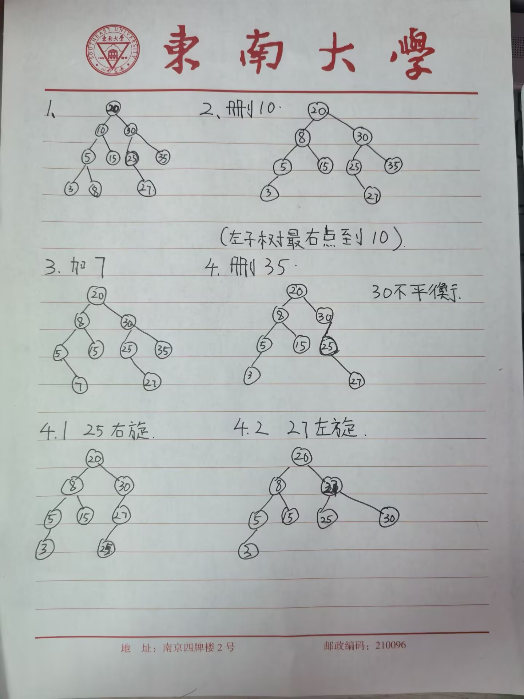
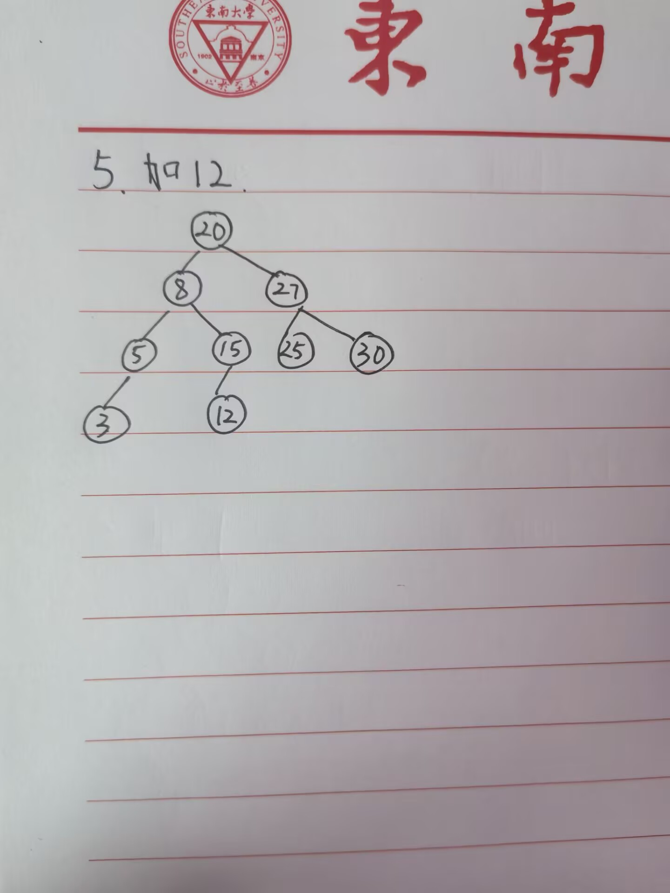

## AVL-Tree

AVL-Tree, 感觉没啥用, 但作业还是得做.

### 人工模拟 AVL-Tree 的过程

Given an initially empty AVL tree, perform the following sequence of operations:

- Insert the keys: [20, 10, 30, 5, 15, 25, 35, 3, 8, 27]
- Delete the key: 10
- Insert the key: 7
- Delete the key: 35
- Insert the key: 12

直接上图:





需要注意的一个地方是删除一个左右儿子都有的点时, 我采取了把左儿子最大值拿到对应位置的方式.

### 生成节点数最少的 AVL-Tree

递归构造，智能指针实现，复杂度是 $O(n)$ 或者 $O(f(h))\approx O(2^h)$。

代码位于 `avl_tree/gen.cpp`, 设置超参数 T=3 和 T=5 可以得到以下结果.(我没做可视化, 直接输出的文字结果, 可视化是人工做的)

T = 3:

```
node: 0, left: 1, right: 5
node: 1, left: 2, right: 4
node: 2, left: 3, right: -1
node: 3, left: -1, right: -1
node: 4, left: -1, right: -1
node: 5, left: 6, right: -1
node: 6, left: -1, right: -1

        0
      /   \
     1     5
    / \   /
   2   4 6
  /
 3
```

T = 5:

```
node: 0, left: 1, right: 13
node: 1, left: 2, right: 9
node: 2, left: 3, right: 7
node: 3, left: 4, right: 6
node: 4, left: 5, right: -1
node: 5, left: -1, right: -1
node: 6, left: -1, right: -1
node: 7, left: 8, right: -1
node: 8, left: -1, right: -1
node: 9, left: 10, right: 12
node: 10, left: 11, right: -1
node: 11, left: -1, right: -1
node: 12, left: -1, right: -1
node: 13, left: 14, right: 18
node: 14, left: 15, right: 17
node: 15, left: 16, right: -1
node: 16, left: -1, right: -1
node: 17, left: -1, right: -1
node: 18, left: 19, right: -1
node: 19, left: -1, right: -1


                              0
             /                              \
            1                               13
       /          \                  /                \
      2            9                14                18
   /       \      /   \           /       \            /
  3        7    10     12        15       17         19
 /  \      /    /                  /
4    6    8                         16
 \
  5
```